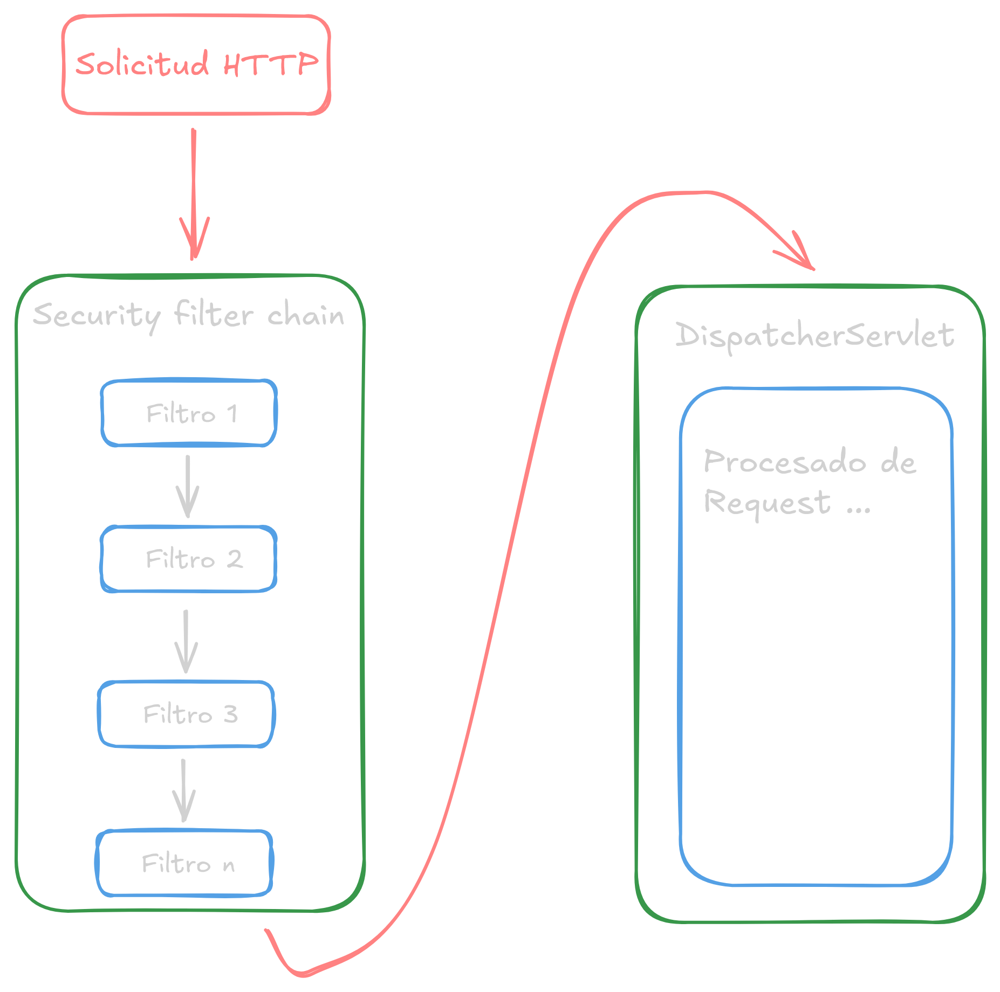

# Security filter chain

El Filter Chain (cadena de filtros) es el mecanismo central de Spring Security basado en el patrón de diseño Chain of Responsibility. Consiste en una serie de filtros de servlet que interceptan las peticiones HTTP antes de que lleguen a los controladores de la aplicación.

## Funcionamiento

Cuando llega una petición HTTP, Spring Security la pasa a través de una secuencia ordenada de filtros `SecurityFilterChain`. Cada filtro realiza una tarea específica de seguridad y decide si la petición puede continuar al siguiente filtro o debe ser rechazada.

El componente principal es el `DelegatingFilterProxy`, un filtro de servlet estándar que delega el trabajo a `FilterChainProxy`, que a su vez gestiona múltiples cadenas de filtros de seguridad.



## Implementación

Para poder configurar un `SecurityFilterChain` creamos la siguiente clase:

```java
// definimos a la clase como una de configuracion
@Configuration
// indicamos a sping que esta clase manejara la seguridad
@EnableWebSecurity
public class SecurityConfig {
	// creamos un bean que retorne SecurityFilterChain
	@Bean
	public SecurityFilterChain securityFilterChain(HttpSecurity http) throws Exception {
		// dentro de este metodo definimos la cadena de filtros con el parametro http
		// ejemplo de filtro:
		http.
				.csrf(customizer -> customizer.disable()); // con esto se desabilita la autenticacion con token csrf
				// por lo general, la mayoria de filtros se trabajan con lambdas
				
		return http.build;
	}
}
```

## Filtros básicos

Algunos filtros básicos que se pueden implementar son:

```java
// requerir autencacion para cualquier request
.authorizeHttpRequests(auth -> auth.anyRequest().authenticated())

// permitir acceso a un endpoint sin la necesidad de autenticacion
.authorizeHttpRequests(auth -> auth.requestMatchers("/usuarios").permitAll())
// el metodo requestMatchers() tambien puede recibir una lista de endpoints

// requerir autenticacion y permitir acceso a endpoints en una sola funcion
.authorizeHttpRequests(auth -> {
    auth.requestMatchers("/usuarios").permitAll(); // permitir acceso a /usuarios sin autenticacion
    auth.anyRequest().authenticated(); // requerir autenticacion para los demas endpoints
})

// habilitar autenticacion mediante la pagina de login
.formLogin(Customizer.withDefaults())

// para redireccionar a endpoint especifico una vez autenticado
.formLogin(Customizer -> {
    Customizer.successHandler((request, response, authentication) -> {
        response.sendRedirect("/redirect"); // una vez se autentica un usario, se lo redirige /redirect
    });
})

// permitir enviar credenciales en el header de la request
// util para habilirtar autenticacion por clientes como postman
.httpBasic(Customizer.withDefaults());
```

### Configuración de políticas de sesiones

Las políticas de sesiones se implementan también como filtros con `.sessionManagement`.

```java
// filtro de sesiones
.sessionManagement( session -> {
	session.sessionCreationPolicy(SessionCreationPolicy.ALWAYS); // crear una politica de sesion
  // sessionCreatePolicy() recibe como parametro una de las siguientes politicas de sesion:
  //      - SessionCreationPolicy.ALWAYS: crea una nueva sesion siempre y cuando no exista ninguna, si ya existe una, la reutiliza
  //      - SessionCreationPolicy.IF_REQUIRED: (por defecto) crea una nueva sesion solo si es necesario
  //      - SessionCreationPolicy.NEVER: no crea nuevas sesiones, solo usa sesiones existentes
  //      - SessionCreationPolicy.STATELESS: no crea ni utiliza ningun tipo de sesión
  
  // endpoint de redireccion en caso de error en la sesion
  session.invalidSessionUrl("/login"); // si la sesion no se puede validar, se redirige a /login

	// cantidad maxima de sesiones, por defecto: 1
	session.maximumSessions(1); // util en aplicaciones multiplataforma que manejan muchas sesiones de un mismo usuario

	// migrar sesiones para evirtar ataques de sesion
	session.sessionFixation().migrateSession(); // implementado por defecto
})
```

## Filtros implementados por defecto

Principales filtros en el orden típico de ejecución:

**1.** **DisableEncodeUrlFilter**

Desactiva la codificación de URLs para evitar que el session ID se agregue a la URL, previniendo vulnerabilidades de seguridad.

**2.** **WebAsyncManagerIntegrationFilter**

Integra el `SecurityContext` con el procesamiento asíncrono de Spring MVC, asegurando que el contexto de seguridad esté disponible en hilos asíncronos.

**3.** **SecurityContextHolderFilter** / **SecurityContextPersistenceFilter**

Establece el `SecurityContext` al inicio de la petición y lo limpia al final. Recupera la información de autenticación desde el repositorio (normalmente la sesión HTTP).

**4.** **HeaderWriterFilter**

Agrega encabezados de seguridad a las respuestas HTTP como X-Content-Type-Options, X-Frame-Options, X-XSS-Protection, para proteger contra ataques comunes.

**5.** **CorsFilter**

Maneja las políticas de Cross-Origin Resource Sharing (CORS), controlando qué dominios externos pueden acceder a los recursos.

**6.** **CsrfFilter**

Protege contra ataques Cross-Site Request Forgery (CSRF) verificando tokens en peticiones que modifican estado (POST, PUT, DELETE).

**7.** **LogoutFilter**

Detecta peticiones de logout (por defecto `/logout`) y ejecuta el proceso de cierre de sesión, limpiando el contexto de seguridad y la sesión.

**8.** **UsernamePasswordAuthenticationFilter**

Procesa peticiones de autenticación mediante formulario (por defecto `/login` con POST). Extrae username y password, y delega la autenticación al `AuthenticationManager`.

**9.** **DefaultLoginPageGeneratingFilter**

Genera automáticamente una página de login por defecto si no se proporciona una personalizada.

**10.** **DefaultLogoutPageGeneratingFilter**

Genera la página de logout por defecto.

**11.** **BasicAuthenticationFilter**

Procesa autenticación HTTP Basic, extrayendo credenciales del encabezado `Authorization`.

**12.** **RequestCacheAwareFilter**

Guarda la petición original antes de la autenticación y la restaura después, permitiendo redirigir al usuario a la página que intentaba acceder.

**13.** **SecurityContextHolderAwareRequestFilter**

Envuelve la petición HTTP con métodos de seguridad adicionales como `isUserInRole()`, integrando la API de Servlet con Spring Security.

**14.**  **AnonymousAuthenticationFilter**

Si no existe autenticación, crea un `Authentication` anónimo, permitiendo que usuarios no autenticados tengan una representación en el sistema.

**15.** **SessionManagementFilter**

Gestiona la creación y validación de sesiones, protegiendo contra ataques de fijación de sesión y controlando sesiones concurrentes.

**16.** **ExceptionTranslationFilter**

Captura excepciones de seguridad (`AuthenticationException` y `AccessDeniedException`) y las traduce en respuestas HTTP apropiadas (redirección a login o error 403).

**17.** **AuthorizationFilter** / **FilterSecurityInterceptor**

El último filtro en la cadena. Verifica si el usuario autenticado tiene los permisos necesarios para acceder al recurso solicitado. Si no, lanza una excepción.