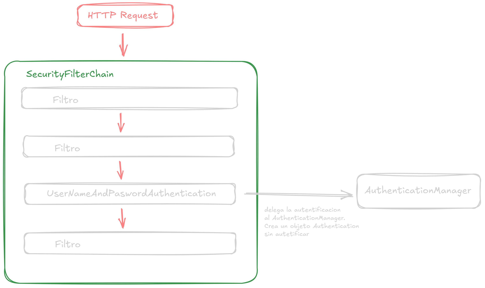
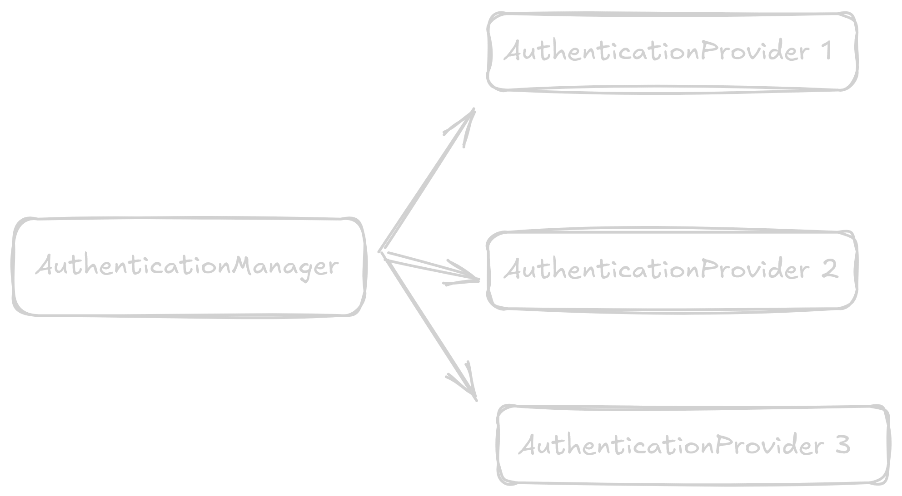
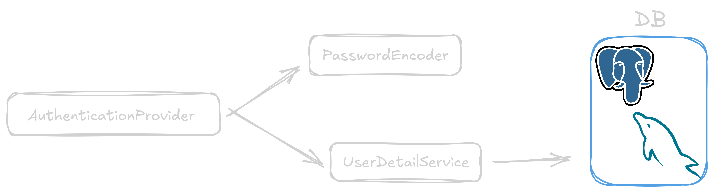
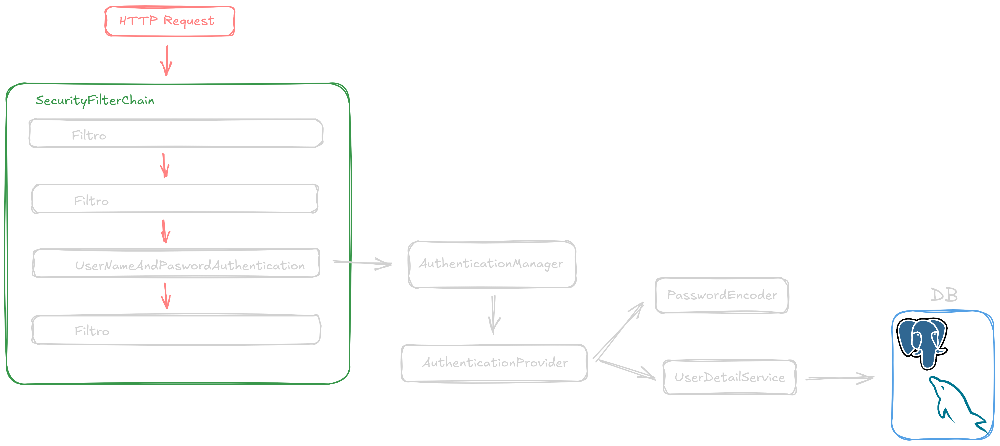

# Flujo de autenticación de usuarios

⚠️ El propósito de esta explicación es entender de manera general y en una forma muy abstraída el funcionamiento de las autenticaciones en spring security, por lo que no se profundiza mucho en su implementación concreta.

El flujo de autentificación de usuarios empieza en el `SecurityFilterChain` con el filtro llamado `UsernamePasswordAuthenticationFilter`. Este filtro es el encargado de interceptar la solicitud HTTP para poder autenticarlas. Para esto genera un Objeto de tipo `Authentication` sin autenticar,  que delega a una implementación de la interfaz `AuthenticationManager`.

El componente implementado con `AuthenticationManager` es el que se encarga verificar como se autentificara la request con una lista de proveedores de autenticación. A estos proveedores de autenticación se los conocen como authentication providers, todos implementan la interfaz `AuthenticationProvider` y proveen de un método especifico para validar las solicitudes.

El `AuthenticationManager` se encarga de iterar sobre la lista de `AuthenticationProvider` y delegar el objeto `Authentication` para su autentificación al proveedor apropiado para cada request.

💬 El authentication provider utilizado para autenticar una request comparando las credenciales con los de una base de datos es: `DaoAuthenticationProvider`.

Luego, para poder acceder a la fuente da datos para verificar las credenciales,  el `AuthenticationProvider` llama a un componente que implemente la interfaz `UserDetailService` para verificar las credenciales. El componente de `UserDetailService` verifica la existencia del usuario y retorna un `UserDetails` con las credenciales necesarias si el usuario existe, de lo contrario, lanza una excepción de tipo `UsernameNotFoundException` .

La interfaz `UserDetails` representa las credenciales del usuario y es utilizada por spring security para poder garantizar todos los métodos necesarios para poder autenticar y autorizar usuarios.

Una vez retornada la implementación de `UserDetails`, el `AuthenticationProvider` se encarga de comparar las credenciales de la petición del usuario con las credenciales cargadas en el `UserDetails`. Para esto utiliza el `PasswordEncoder` para comparar la contraseñas porque generalmente las contraseñas se guardan codificadas en las bases de datos (generalmente se utiliza el encoder BCrypt).

Con esto, el `AuthenticationProvider` compara las credenciales y permisos, y retorna el componente `Authentication` ya autenticado en caso de que todo coincida, si no coinciden, lanza la excepción `BadCredentialsException`.

Con esto el flujo básico de una autenticación seria de la siguiente forma:

